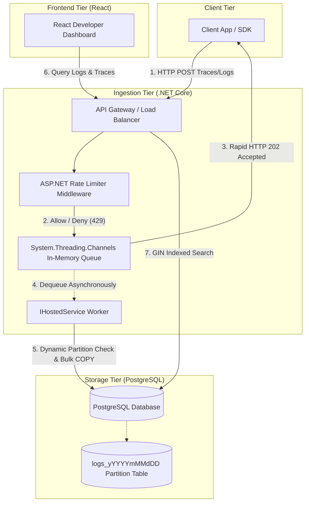

# Beacon — API Performance Monitoring & Exception Tracker (Sentry Clone)

Beacon is a high-performance developer console designed for log ingestion, nested API tracing, exception parsing, and real-time monitoring. Inspired by Sentry, Beacon leverages asynchronous in-memory queueing in .NET, optimized range partitioning in PostgreSQL, and GIN indexes to handle heavy log traffic and surface actionable debugging insights.

---

## 🛠️ Architecture & Technology Stack



### 1. Ingestion Tier (.NET Core Web API)
* **High-Throughput Channels**: Utilizes a bounded `System.Threading.Channels.Channel<T>` buffer to ingest logs. When logs arrive at `/api/events`, the server enqueues them in memory and instantly returns an `HTTP 202 Accepted` status, decoupling network requests from slow disk writes.
* **Log Storm Protection**: An ASP.NET Core Partitioned Token-Bucket Rate Limiter middleware evaluates incoming requests by Client IP or API Key to prevent server starvation during crash loops.
* **Asynchronous Batching Worker**: A hosted background service drains the queue in batches (up to 1,000 logs at a time) and pushes them to PostgreSQL.

### 2. Database Tier (PostgreSQL)
* **Dynamic Range Partitioning**: The database partitions the `logs` table by day. When the background worker flushes a batch, it queries a custom PL/pgSQL function `create_daily_partition(target_date)` to automatically create the table partition if it doesn't exist. This allows dropping logs older than 30 days via instant `DROP TABLE` operations instead of expensive, index-bloating `DELETE` queries.
* **GIN Index on JSONB**: A Generalized Inverted Index using `jsonb_path_ops` indexes the `metadata` column, supporting sub-millisecond containment queries (e.g. searching for browser context or CPU load).

### 3. Frontend Tier (React & TypeScript)
* **Waterfall Timelines**: Visually charts nested tracing scopes (e.g. database transactions and external APIs nested inside an API call) to identify performance bottlenecks.
* **Query Builder**: Supports structured queries filtering by Service, Environment, Log Level, Latency, and custom metadata tags.
* **Overview Charts**: Displays error frequency over time and latency percentiles (Avg, p95) using Recharts.

---

## 🚀 Getting Started

### Prerequisites
* **.NET 8.0 SDK**
* **Node.js (v18+)**
* **PostgreSQL 14+**

### 1. Database Setup
1. Connect to your local PostgreSQL instance and create the database:
   ```sql
   CREATE DATABASE beacon;
   ```
2. Apply the schema located in `schema.sql`:
   ```bash
   psql -h localhost -d beacon -f schema.sql
   ```

### 2. Running the Ingestion Server
1. Navigate to the ingestion directory:
   ```bash
   cd Beacon.Ingestion
   ```
2. Run the application:
   ```bash
   dotnet run
   ```
   *The server will start listening on `http://localhost:5285`.*

### 3. Running the React Dashboard Console
1. Navigate to the dashboard directory:
   ```bash
   cd beacon-dashboard
   ```
2. Install npm dependencies and start the development server:
   ```bash
   npm install
   npm run dev
   ```
   *Open `http://localhost:5173` in your browser.*

### 4. Seeding Logs with the Emulator
1. Navigate to the emulator directory:
   ```bash
   cd Beacon.Emulator
   ```
2. Run the emulator:
   ```bash
   dotnet run
   ```
3. Select an execution mode:
   * **`1`**: Sends a single batch of simulated trace trees & exceptions.
   * **`2`**: Continuously loops and pushes simulated traffic.
   * **`3`**: Initiates a high-concurrency log storm to test the Token Bucket rate limiters.
