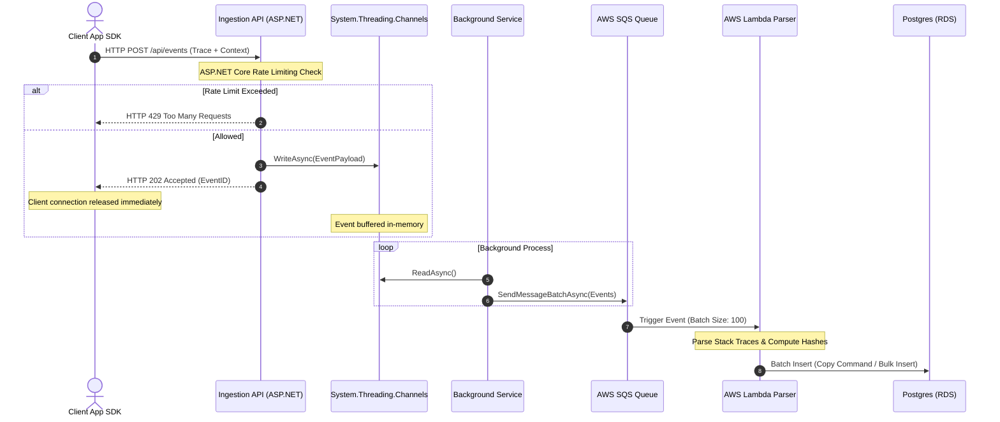
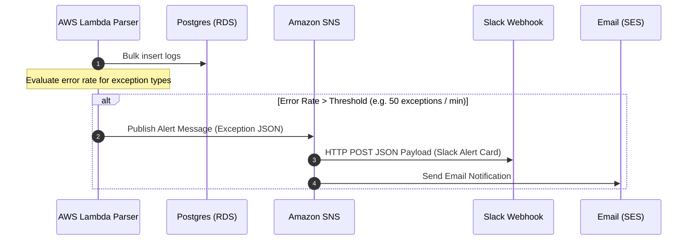
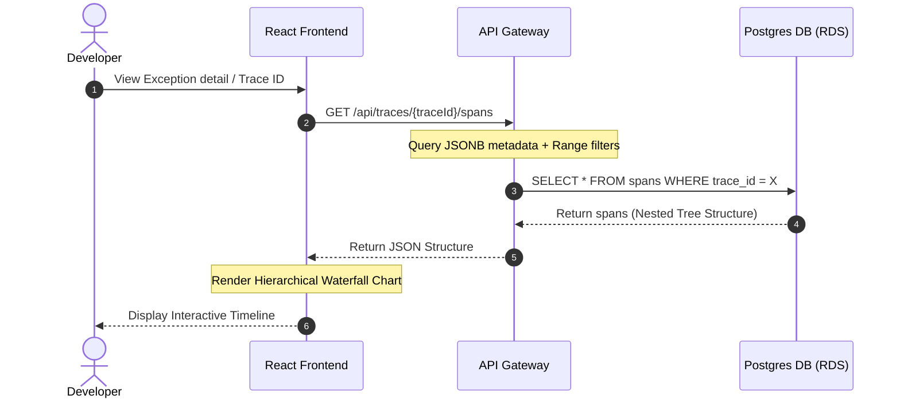

# Software Requirements Specification (SRS)

## Project 6: "Beacon" — API Performance Monitoring & Exception Tracker (Sentry Clone)

---

## 1. Introduction

### 1.1 Purpose
This document details the Software Requirements Specification (SRS) for **Beacon**, a high-performance, developer-focused API performance monitoring and exception tracking platform (similar to Sentry). Beacon provides client SDK integration, high-throughput log ingestion, real-time alert dispatching, trace waterfall visualization, and dynamic query filtering across structured and semi-structured metrics.

### 1.2 Scope
Beacon consists of:
1. **Beacon Client SDKs** (Mocked and/or real HTTP clients) for sending logs, traces, and metrics.
2. **High-Throughput Ingestion Server** (C# .NET Core): Rapid-response endpoints using `System.Threading.Channels` for asynchronous queueing and HTTP 202 dispatch.
3. **AWS SQS & Lambda Processing Layer**: A scalable asynchronous worker pipeline utilizing AWS SQS to buffer log storms and AWS Lambda to process stack traces and batch insert to database.
4. **Relational & Semi-Structured Database** (PostgreSQL): High-performance storage implementing range partitioning by date and a `JSONB` column indexed via GIN (Generalized Inverted Index) for nested querying.
5. **Real-time Alerting** (Amazon SNS): Spike detection triggering Slack Webhooks and Email notifications.
6. **Developer Dashboard** (React): Responsive visualization suite featuring a Query Builder and a trace Waterfall chart showing nested DB queries and external API calls.

### 1.3 Definitions & Abbreviations
* **SRS**: Software Requirements Specification
* **GIN Index**: Generalized Inverted Index (PostgreSQL)
* **JSONB**: Binary JSON storage format in PostgreSQL
* **System.Threading.Channels**: High-performance in-memory queues in .NET
* **Waterfall Chart**: Hierarchical timeline view of nested trace spans
* **Log Storm**: A sudden spike of error logs (e.g. client application infinite loop)

---

## 2. System Architecture

### 2.1 High-Level Architecture Diagram
The following Mermaid diagram illustrates the data flow from client SDKs to the database and alerts, including both local-dev and AWS Cloud architectures.

```mermaid
graph TD
    classDef primary fill:#4F46E5,stroke:#312E81,color:#FFF;
    classDef secondary fill:#06B6D4,stroke:#0891B2,color:#FFF;
    classDef db fill:#10B981,stroke:#065F46,color:#FFF;
    classDef cloud fill:#F59E0B,stroke:#92400E,color:#FFF;

    subgraph ClientApplications["Client Tier"]
        Client[Client App / SDK]
    end

    subgraph APIIngestion["Ingestion Tier (.NET Core)"]
        Gateway[API Gateway / Load Balancer]:::primary
        RateLimiter[ASP.NET Rate Limiter Middleware]:::primary
        ChannelBuffer[System.Threading.Channels In-Memory Queue]:::primary
        WorkerService[IHostedService Worker]:::primary
    end

    subgraph AWSCloud["AWS Processing Tier"]
        SQSQueue[AWS SQS: Log Ingestion Queue]:::cloud
        LambdaWorker[AWS Lambda: Parser & Batcher]:::cloud
        SNSAlerts[Amazon SNS]:::cloud
    end

    subgraph StorageTier["Storage & Notification Tier"]
        Postgres[(PostgreSQL RDS Database)]:::db
        PartitionTable[(logs_YYYY_MM_DD Partition Table)]:::db
        SlackWebhook[Slack Webhook App]:::secondary
        EmailService[SES / Email Client]:::secondary
    end

    %% Flow lines
    Client -->|1. HTTP POST Traces/Logs| Gateway
    Gateway --> RateLimiter
    RateLimiter -->|2. Allow / Deny (429)| ChannelBuffer
    ChannelBuffer -->|3. Rapid HTTP 202 Accepted| Client
    ChannelBuffer -.->|4. Dequeue Asynchronously| WorkerService
    WorkerService -->|5. Write Batch| SQSQueue
    SQSQueue -->|6. Trigger Event| LambdaWorker
    LambdaWorker -->|7a. Batch Insert| Postgres
    Postgres -.-> PartitionTable
    LambdaWorker -->|7b. Publish Spike Alert| SNSAlerts
    SNSAlerts -->|8a. Trigger Slack Webhook| SlackWebhook
    SNSAlerts -->|8b. Send Alert Email| EmailService

    %% UI Query Flow
    ReactUI[React Developer Console]:::secondary -->|Query API| Gateway
    Gateway -->|Select Query| Postgres
```

---

## 3. Detailed Workflow & Flows

### 3.1 Ingestion Flow (Client Exception to Storage)
The system prioritizes ingestion speed. The ASP.NET ingestion endpoint buffers the request in a thread-safe in-memory channel, returns `202 Accepted` to the client instantly, and processes the queue out-of-process.



### 3.2 Real-time Spike Detection & Alert Flow
Alert triggers prevent alert fatigue by evaluating moving window error thresholds.



### 3.3 Trace Query & Visualization Flow
The React Frontend builds a visual tree of nested span traces (database queries, external API dependencies) executing during a single client request.



---

## 4. System Components & Functional Requirements

### 4.1 React Frontend
* **Trace Waterfall Chart**:
  - Must render a hierarchical chart showing nested traces (parent-child relationships).
  - Must visually map the duration of database calls (`SELECT`, `UPDATE`) and external network requests (`HTTP GET`, etc.) relative to the parent API lifecycle.
  - Interactive nodes displaying query details, SQL commands, and request headers on click.
* **Log Query Builder**:
  - Structured fields for: `Environment` (e.g., staging, production), `Response Code` range, and `LogLevel`.
  - Dynamic Custom Tag filters supporting key-value lookup (e.g., `browser_name == "Chrome"`, `user_role == "Admin"`).
  - High-performance, debounced searching matching logs in real time.
* **Real-time Charting**:
  - Dashboard tracking: Error rates over time, top 5 throwing exceptions, and 95th/99th percentile API latency.

### 4.2 C# .NET Ingestion Backend
* **Asynchronous Buffer (`System.Threading.Channels`)**:
  - Utilize `BoundedChannel<T>` with a strict capacity (e.g., 10,000 items) to prevent Out-Of-Memory (OOM) exceptions under load.
  - Implement full-mode behavior configurations (`DropOldest`, `DropNewest`, or `Wait`).
  - Background Hosted Service (`IHostedService`) serving as the reader, flushing events into database/SQS batches.
* **ASP.NET Core Rate Limiting Middleware**:
  - Rate limits based on client API Keys and source IP addresses.
  - Configure token-bucket algorithm: Max 100 requests per 10-second window, replenishing 10 tokens per second.
  - Return `HTTP 429 Too Many Requests` with a `Retry-After` header.

### 4.3 PostgreSQL Database
* **Range Partitioning**:
  - Main logs table: `logs` (partitioned by range on `timestamp` column).
  - Automated weekly or daily partition creation script/job.
  - Partition dropping strategy: Instantly drop daily tables older than 30 days (`DROP TABLE logs_yyyy_mm_dd`) instead of running expensive `DELETE` commands which lock the table and bloat indexes.
* **JSONB Column & GIN Index**:
  - Column name: `metadata` (`JSONB`).
  - GIN Index creation:
    ```sql
    CREATE INDEX idx_logs_metadata_gin ON logs USING gin (metadata jsonb_path_ops);
    ```
  - Optimize filters targeting arbitrary user properties (e.g., CPU load, memory footprint, browser details, user state).

### 4.4 AWS Cloud Architecture (Production Setup)
* **AWS SQS Queue**:
  - Configured with a Dead Letter Queue (DLQ) to capture malformed payloads.
  - Message retention period: 4 days.
  - Message visibility timeout: 30 seconds.
* **AWS Lambda processing**:
  - Python or Node.js Lambda function triggered by SQS.
  - Formats logs, parses stack traces (obfuscating sensitive data), and performs bulk copy inserts into RDS PostgreSQL.
* **Amazon SNS Alert Engine**:
  - Publishes alert events to SNS Topics (e.g., `beacon-alerts-topic`).
  - SNS distributes to multiple subscribers: Email (SES), Slack Webhook (Lambda execution), or PagerDuty.

---

## 5. Technical Specifications & Database Schema

### 5.1 Database Schema (SQL DDL)

Below is the structured relational DDL representing the logs, traces, and partition setup:

```sql
-- Create base partitioned table
CREATE TABLE logs (
    id UUID NOT NULL,
    timestamp TIMESTAMPTZ NOT NULL,
    trace_id UUID NULL,
    span_id UUID NULL,
    parent_span_id UUID NULL,
    service_name VARCHAR(100) NOT NULL,
    environment VARCHAR(50) NOT NULL,
    log_level VARCHAR(20) NOT NULL,
    message TEXT NOT NULL,
    exception_type VARCHAR(255) NULL,
    stack_trace TEXT NULL,
    duration_ms INT NULL,
    metadata JSONB NULL,
    PRIMARY KEY (timestamp, id)
) PARTITION BY RANGE (timestamp);

-- GIN Index on JSONB column for optimized querying
CREATE INDEX idx_logs_metadata_gin ON logs USING gin (metadata jsonb_path_ops);

-- Supporting index for latency / performance queries
CREATE INDEX idx_logs_perf ON logs (service_name, duration_ms) WHERE duration_ms IS NOT NULL;

-- Supporting index for tracing waterfall mapping
CREATE INDEX idx_logs_trace ON logs (trace_id) WHERE trace_id IS NOT NULL;
```

---

## 6. Non-Functional Requirements

| Metric | Target | Verification Method |
| :--- | :--- | :--- |
| **Ingestion Latency** | HTTP 202 response within < 15ms | Apache Benchmark / k6 load testing |
| **Throughput Capacity** | Ingest up to 5,000 logs/sec | k6 concurrency testing |
| **Data Retention** | 30 days rolling data store | Cron partition drop schedule |
| **Search Query Latency** | GIN-indexed JSONB lookups < 100ms | PostgreSQL Explain Analyze |
| **Availability** | 99.9% uptime | AWS Multi-AZ deployment configurations |

---

## 7. Verification & Implementation Plan

### 7.1 Automated Verification Tests
* **Load Test (k6)**: Execute high-throughput requests to verify rate limits and evaluate HTTP 202 response times.
* **PostgreSQL Performance Profiling**: Verify query speed on `JSONB` fields using `EXPLAIN ANALYZE`.
* **Integration Tests**: Verify that `System.Threading.Channels` properly buffers logs under CPU starvation simulations.

### 7.2 Staged Implementation Route
1. **Stage 1 (Backend & Database Core)**: Setup PostgreSQL local schema, partition generation mechanism, and C# ASP.NET Core Ingestion service with rate-limiters.
2. **Stage 2 (Queueing & Asynchronous Pipelines)**: Implement `System.Threading.Channels` and setup simulated SQS/Lambda batch handlers locally.
3. **Stage 3 (Frontend Console)**: Design React SPA featuring Dashboard charts, Waterfall traces, and a query builder.
4. **Stage 4 (Cloud Infrastructure Integration)**: Deploy pipelines using serverless handlers or Dockerized instances on AWS ECS/Lambda/RDS.
